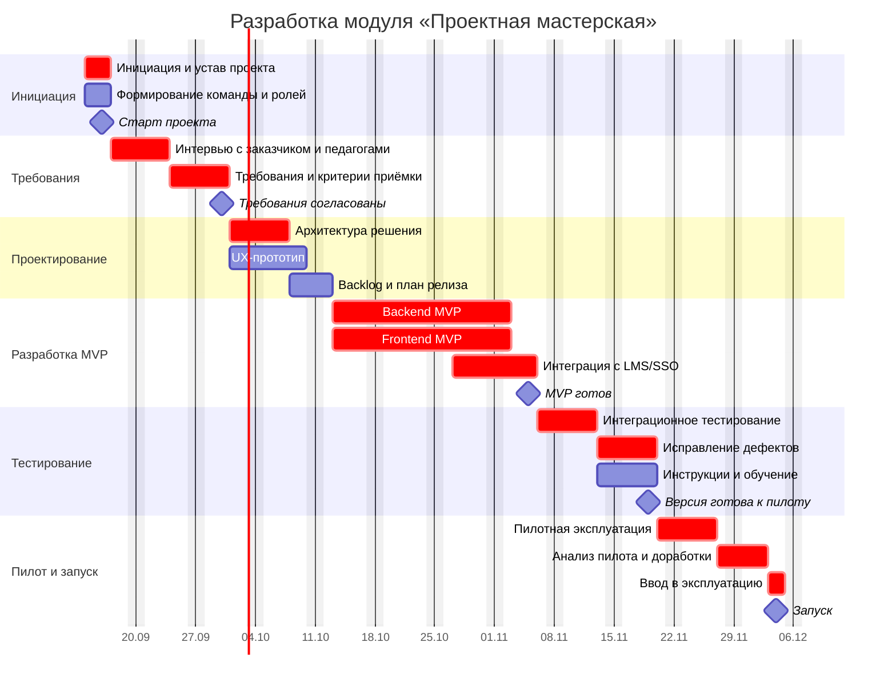

# Проект «Проектная мастерская»

> Демонстрационный отчёт по заданию: **создание диаграммы Ганта для организации проектной деятельности по разработке компонента образовательной среды для образовательного учреждения и анализ потенциальных рисков**.

**Студент:** Клементьев Алексей Александрович  
**Группа:** 2ом_КЭО/25  
**Дисциплина:** «Управление IT-проектами для корпоративного обучения»  
**Дата:** 10.09.2026  

---

## 1. Цель работы

Спланировать проект по разработке компонента цифровой образовательной среды образовательного учреждения, представить календарный план в форме диаграммы Ганта, определить зависимости между работами, распределить ответственность участников и провести анализ потенциальных проектных рисков.

Для визуализации календарного плана используется **Mermaid Gantt**. Исходный код диаграммы хранится непосредственно в Markdown и версионируется средствами Git вместе с остальными материалами проекта.

---

## 2. Описание компонента образовательной среды

В рамках демонстрационного проекта разрабатывается модуль **«Проектная мастерская»** — веб-компонент цифровой образовательной среды образовательного учреждения для организации проектной деятельности обучающихся.

### 2.1. Назначение

Компонент должен предоставить единое пространство, в котором:

- преподаватель создаёт учебный проект, формулирует цель, задачи и ожидаемые результаты;
- обучающиеся объединяются в проектные команды;
- для проекта задаются этапы, контрольные точки и сроки;
- участники прикрепляют ссылки на результаты и отмечают статус выполнения;
- наставник или преподаватель оставляет обратную связь;
- куратор видит общий прогресс команд и просроченные задачи;
- пользователи входят через существующую учётную запись образовательного учреждения.

### 2.2. Основные функции MVP

| № | Функция | Результат |
|---|---|---|
| F1 | Создание учебного проекта | Карточка проекта с целью, сроками и описанием |
| F2 | Формирование команд | Привязка обучающихся к проектным группам |
| F3 | Этапы и контрольные точки | План проекта с дедлайнами и статусами |
| F4 | Отслеживание прогресса | Процент выполнения и состояния задач |
| F5 | Представление результата | Добавление ссылок и файлов/артефактов |
| F6 | Обратная связь | Комментарии и отметка результата преподавателем |
| F7 | Панель преподавателя | Сводная информация по командам |
| F8 | Интеграция с LMS/SSO | Вход существующих пользователей без отдельной регистрации |

### 2.3. Ограничения демонстрационного проекта

Проект рассматривается как MVP. В первую версию не включаются встроенный видеохостинг, полноценный мессенджер, мобильное приложение и сложная аналитика. Эти функции могут быть вынесены в последующие релизы.

---

## 3. Заинтересованные стороны

| Участник | Интерес / ответственность |
|---|---|
| Руководство учреждения / заказчик | Определяет цели и принимает результат |
| Руководитель проекта | Планирование, сроки, координация, риски и отчётность |
| Методист / Product Owner | Формирует требования с позиции образовательного процесса |
| Системный аналитик | Уточняет требования, интеграции и критерии приёмки |
| UX/UI-дизайнер | Проектирует пользовательские сценарии и интерфейс |
| Backend-разработчик | Реализует бизнес-логику и интеграции |
| Frontend-разработчик | Реализует пользовательский интерфейс |
| QA-инженер | Планирует и выполняет тестирование |
| Системный администратор | Тестовая и эксплуатационная инфраструктура |
| Педагоги пилотной группы | Проверяют решение в реальном учебном процессе |
| Обучающиеся | Конечные пользователи компонента |

---

## 4. Организация проектной деятельности

Для демонстрационного проекта используется **гибридная схема управления**:

1. Инициация и фиксация границ проекта.
2. Сбор и согласование требований.
3. Проектирование архитектуры и UX.
4. Разработка MVP короткими итерациями.
5. Интеграция и тестирование.
6. Пилотная эксплуатация.
7. Доработка и ввод в эксплуатацию.

Разработка ведётся итерационно, но ключевые этапы и контрольные точки заранее отражены в календарном плане.

### 4.1. Рабочие правила

- рабочая неделя — понедельник–пятница;
- общий срок демонстрационного проекта — **14 сентября – 4 декабря 2026 г.**;
- руководитель проекта еженедельно актуализирует план и реестр рисков;
- в начале каждой итерации уточняется набор задач;
- по завершении существенного этапа проводится демонстрация результата заказчику;
- изменения требований, влияющие на сроки или объём MVP, фиксируются отдельно;
- критические дефекты должны быть закрыты до начала пилота.

### 4.2. Коммуникации

| Активность | Периодичность | Участники | Результат |
|---|---|---|---|
| Статус-встреча | 1 раз в неделю | Команда проекта | Статус, блокеры, решения |
| Планирование итерации | Каждые 2 недели | PM, PO, разработка, QA | Уточнённый backlog |
| Демонстрация | В конце итерации | Команда, заказчик, методист | Приём обратной связи |
| Проверка рисков | 1 раз в неделю | PM + владельцы рисков | Актуальный реестр рисков |
| Приёмка этапа | По контрольным точкам | Заказчик, PM, PO | Решение о переходе дальше |

---

## 5. Декомпозиция работ

| Код | Работа | Период | Ответственный | Результат |
|---|---|---|---|---|
| A1 | Инициация и устав проекта | 14–16.09 | PM | Цель, границы, ограничения |
| A2 | Формирование команды и ролей | 14–16.09 | PM | Матрица ответственности |
| B1 | Интервью с заказчиком и педагогами | 17–23.09 | Analyst / PO | Потребности пользователей |
| B2 | Требования и критерии приёмки | 24–30.09 | Analyst / PO | Согласованный набор требований |
| C1 | Архитектура решения | 01–07.10 | Backend / Analyst | Архитектурная схема и API |
| C2 | UX-прототип | 01–09.10 | UX/UI | Кликабельный прототип |
| C3 | Backlog и план релиза | 08–12.10 | PM / PO | Приоритизированный backlog |
| D1 | Backend MVP | 13.10–02.11 | Backend | Серверная часть MVP |
| D2 | Frontend MVP | 13.10–02.11 | Frontend | Пользовательский интерфейс |
| D3 | Интеграция с LMS/SSO | 27.10–05.11 | Backend / Admin | Авторизация и обмен данными |
| E1 | Интеграционное тестирование | 06–12.11 | QA | Отчёт о тестировании |
| E2 | Исправление дефектов | 13–19.11 | Dev team | Стабилизированная версия |
| E3 | Инструкции и обучение | 13–19.11 | PO / Methodologist | Инструкция и материалы |
| F1 | Пилотная эксплуатация | 20–26.11 | PM / Pilot teachers | Обратная связь пилотной группы |
| F2 | Анализ пилота и доработки | 27.11–02.12 | Team | Финальные исправления |
| G1 | Ввод в эксплуатацию | 03–04.12 | PM / Admin | Рабочая версия |

---

## 6. Диаграмма Ганта

В диаграмме задачи, существенно влияющие на итоговый срок проекта, помечены как `crit`. Выходные дни исключены из рабочего календаря.



Исходный код диаграммы также вынесен в файл [`docs/gantt.mmd`](docs/gantt.mmd).  
Для использования вне GitHub подготовлен резервный графический вариант: [`docs/gantt-preview.png`](docs/gantt-preview.png).

### 6.1. Ключевые контрольные точки

| Дата | Контрольная точка |
|---|---|
| 16.09.2026 | Проект инициирован, команда сформирована |
| 30.09.2026 | Требования согласованы |
| 05.11.2026 | MVP функционально собран |
| 19.11.2026 | Версия готова к пилотной эксплуатации |
| 04.12.2026 | Компонент введён в эксплуатацию |

### 6.2. Критический контур

Для демонстрационных целей критический контур рассматривается как последовательность:

**инициация → сбор и согласование требований → архитектура → разработка MVP → интеграция → тестирование → исправление дефектов → пилот → финальные доработки → запуск.**

Задержка этих работ без использования временного резерва напрямую угрожает дате запуска. Параллельные активности (например, UX-проектирование и подготовка инструкций) также важны, но имеют большую возможность для перераспределения ресурсов.

---

## 7. Анализ потенциальных рисков

### 7.1. Метод оценки

Для демонстрационного анализа используется полуколичественная оценка:

- **P — вероятность:** от 1 (очень низкая) до 5 (очень высокая);
- **I — влияние:** от 1 (незначительное) до 5 (критическое);
- **R = P × I** — интегральная оценка риска.

Интерпретация:

| Балл R | Уровень | Действие |
|---:|---|---|
| 1–4 | Низкий | Наблюдение |
| 5–9 | Средний | Плановые меры снижения |
| 10–16 | Высокий | Активное управление и контроль |
| 17–25 | Критический | Немедленные меры и эскалация |

### 7.2. Реестр рисков

| ID | Риск | P | I | R | Уровень | Профилактические меры | План реагирования | Владелец |
|---|---|---:|---:|---:|---|---|---|---|
| R1 | Расширение объёма требований после согласования MVP | 4 | 4 | 16 | Высокий | Зафиксировать границы MVP и процедуру change request | Перенос некритичных функций в следующий релиз | PM / PO |
| R2 | Недоступность ключевых педагогов для интервью и приёмки | 3 | 3 | 9 | Средний | Заранее согласовать календарь встреч, иметь замещающих экспертов | Использовать письменное согласование и резервные слоты | PM |
| R3 | Проблемы интеграции с существующей LMS/SSO | 3 | 5 | 15 | Высокий | Ранний технический прототип, проверка API и тестового контура | Временная упрощённая авторизация / перенос части интеграции | Backend / Admin |
| R4 | Нарушение требований защиты персональных данных | 2 | 5 | 10 | Высокий | Минимизация собираемых данных, разграничение доступа, аудит решения | Блокировка проблемной функции и исправление до пилота | PM / Admin |
| R5 | Отставание разработки от календарного плана | 3 | 5 | 15 | Высокий | Приоритизация backlog, контроль velocity, резерв по некритичным функциям | Сократить scope MVP, перераспределить разработчиков | PM / Dev lead |
| R6 | Недостаточное качество тестирования перед пилотом | 3 | 4 | 12 | Высокий | Критерии входа/выхода из тестирования, тест-кейсы, раннее QA | Продлить стабилизацию за счёт второстепенных функций | QA / PM |
| R7 | Низкая готовность педагогов пользоваться новым компонентом | 3 | 4 | 12 | Высокий | Вовлечение педагогов в прототипирование и пилот, краткие инструкции | Дополнительное обучение, упрощение UX | PO / Methodologist |
| R8 | Низкое качество или несовместимость исходных данных LMS | 3 | 3 | 9 | Средний | Ранний анализ форматов и тестовых данных | Очистка/преобразование данных, ручная загрузка для пилота | Analyst / Backend |
| R9 | Временная недоступность ключевого специалиста команды | 2 | 4 | 8 | Средний | Документирование решений, code review, распределение знаний | Переназначение задач, привлечение резервного специалиста | PM |
| R10 | Недостаточная производительность инфраструктуры при пилоте | 2 | 4 | 8 | Средний | Нагрузочное тестирование и мониторинг | Масштабирование ресурсов / ограничение тяжёлых операций | Admin / Backend |

Полная табличная версия дополнительно сохранена в [`docs/risk-register.csv`](docs/risk-register.csv).

### 7.3. Приоритетные риски

Наибольшего внимания требуют **R1, R3, R5, R6 и R7**.

1. **R1 — изменение требований.** Опасно тем, что затрагивает сразу объём работ, сроки разработки и тестирования. Основной способ управления — жёстко определить состав MVP и оценивать каждое новое требование через влияние на срок и ресурсы.
2. **R3 — интеграция с LMS/SSO.** Имеет высокое влияние, поэтому проверка интеграционного интерфейса должна выполняться до завершения основной разработки.
3. **R5 — отставание разработки.** Связано с критическим контуром диаграммы Ганта. При появлении устойчивого отставания приоритетом становится сохранение даты запуска за счёт сокращения низкоприоритетного scope.
4. **R6 — недостаточное тестирование.** Перенос дефектов в пилот может сделать результаты пилота недостоверными и привести к задержке запуска.
5. **R7 — низкое принятие пользователями.** Даже технически корректный продукт не достигнет образовательной цели, если педагоги сочтут процесс слишком сложным. Поэтому представители пользователей включаются в проект до пилота.

### 7.4. Связь рисков с календарным планом

| Этап Ганта | Наиболее существенные риски | Контроль |
|---|---|---|
| Требования | R1, R2 | Согласование MVP и критериев приёмки |
| Проектирование | R3, R4 | Технический прототип интеграции, проверка модели доступа |
| Разработка | R1, R5, R9 | Контроль backlog, сроков и загрузки команды |
| Интеграция и тестирование | R3, R4, R6, R10 | Интеграционные, security- и нагрузочные проверки |
| Пилот | R6, R7, R8, R10 | Сбор обратной связи, мониторинг ошибок и нагрузки |
| Запуск | R4, R5, R7 | Финальная приёмка и готовность поддержки |

---

## 8. Контроль выполнения проекта

Проект считается готовым к запуску при одновременном выполнении следующих условий:

- реализованы функции F1–F8 либо официально согласовано исключение функции из MVP;
- отсутствуют открытые критические дефекты;
- пройдены основные пользовательские сценарии;
- вход через LMS/SSO работает в эксплуатационном контуре;
- выполнен пилот минимум с одной группой пользователей;
- подготовлена пользовательская инструкция;
- заказчик подтвердил выполнение критериев приёмки;
- по высоким рискам отсутствуют неконтролируемые события, блокирующие запуск.

### 8.1. Показатели проекта

| Показатель | Целевое значение |
|---|---|
| Соблюдение даты запуска | Не позднее 04.12.2026 |
| Критические дефекты на момент запуска | 0 |
| Выполнение согласованного MVP | ≥ 90% |
| Успешность основных сценариев пилота | ≥ 95% |
| Доля пилотных пользователей, завершивших сценарий без помощи | ≥ 80% |
| Высокие риски без назначенного владельца | 0 |

---

## 9. Структура репозитория

```text
gantt-edu-project/
├── README.md
└── docs/
    ├── gantt.mmd
    ├── gantt-preview.png
    └── risk-register.csv
```

Рекомендуемое имя репозитория: **`gantt-edu-project`**.

---

## 10. Выводы

В ходе работы сформирован демонстрационный проект разработки компонента цифровой образовательной среды **«Проектная мастерская»**.

Была определена цель компонента, описаны заинтересованные стороны, состав MVP, роли проектной команды и правила организации работ. Проект декомпозирован на этапы от инициации до ввода в эксплуатацию; определены зависимости и контрольные точки.

На основе календарного плана создана диаграмма Ганта в формате Mermaid. План показывает параллельные и последовательные работы, а также критический контур, от которого зависит целевая дата запуска.

Проведён анализ потенциальных рисков: сформирован реестр, выполнена оценка вероятности и влияния, определены наиболее значимые риски, владельцы и меры реагирования. Таким образом, цель работы — **спланировать проект разработки компонента образовательной среды и проанализировать риски его реализации — достигнута**.

---

## 11. Использованные источники

1. GitHub Docs. Creating diagrams [Электронный ресурс]. URL: https://docs.github.com/en/get-started/writing-on-github/working-with-advanced-formatting/creating-diagrams (дата обращения: 10.09.2026).
2. Mermaid. Gantt diagrams [Электронный ресурс]. URL: https://mermaid.js.org/syntax/gantt.html (дата обращения: 10.09.2026).
3. ISO 31000:2018. Risk management — Guidelines [Электронный ресурс]. URL: https://www.iso.org/standard/65694.html (дата обращения: 10.09.2026).

---

## 12. Примечание

Проект создан в демонстрационных целях. Сроки, состав команды, оценки рисков и показатели могут быть адаптированы под конкретное образовательное учреждение и его информационную инфраструктуру.
